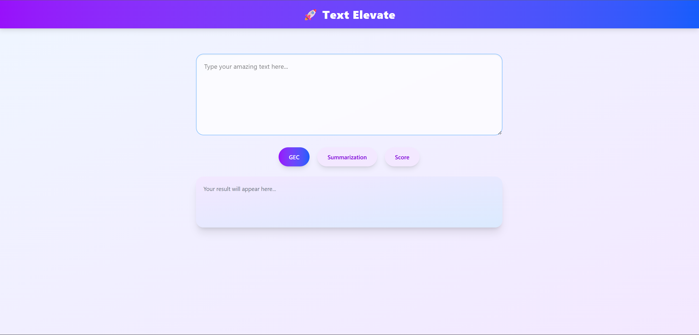
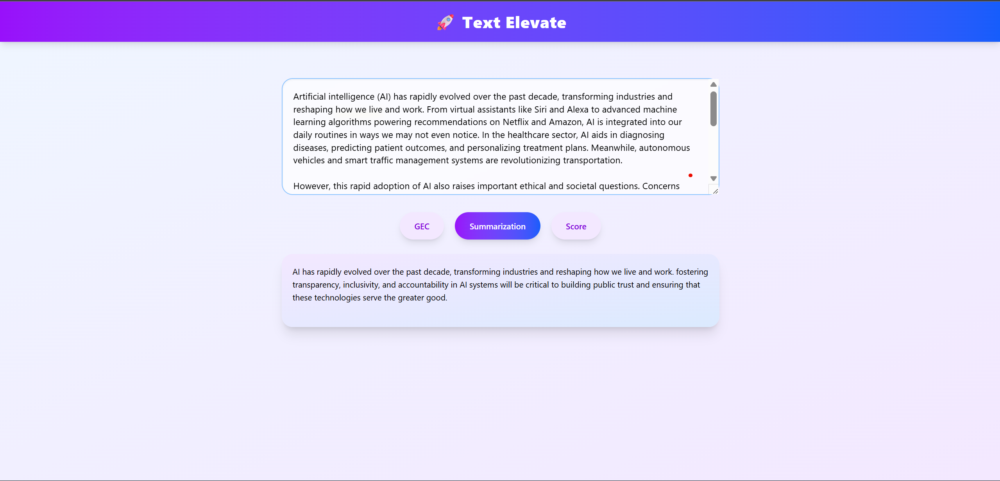
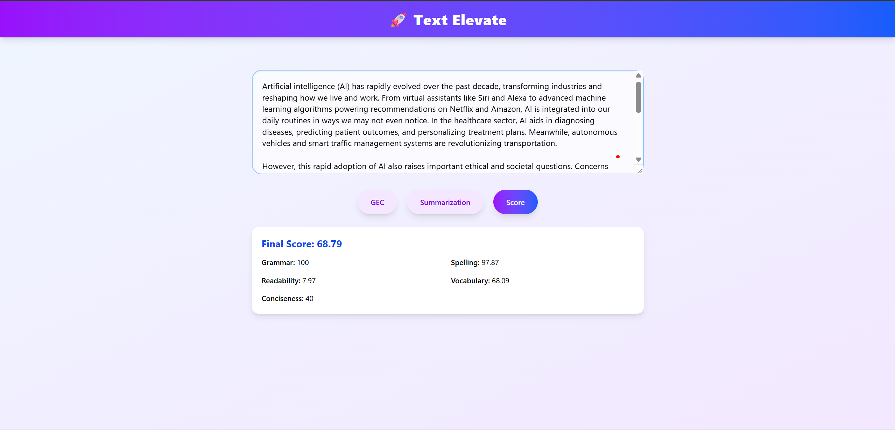

# Text Elevate 🚀

**Text Elevate** is a modern React + Tailwind CSS web app that provides:

- ✅ Grammar Error Correction (GEC)
- ✅ Text Summarization (with token limits)
- ✅ Paragraph Scoring (with token limits)

🎨 Built with a vibrant, fun UI designed for a smooth user experience. The app connects to a FastAPI backend for processing text.

---

## 📸 Screenshots

### 🖥️ Main Interface



### 📊 Grammar Correction Example


### 📝 Summarization Example



### 📊 Scorecard Example



## 💻 Features

- **Grammar Correction:** Instantly correct grammatical errors in your input text.
- **Summarization:** Generate a summary (input must be between 30 and 500 tokens).
- **Paragraph Scoring:** Get a detailed score breakdown (input must be between 30 and 500 tokens).
- **Modern, clean UI:** Built with React + Tailwind CSS for a responsive and vibrant design.

---

## 🚀 Tech Stack

| Layer    | Tech                                      |
| -------- | ----------------------------------------- |
| Frontend | React, Tailwind CSS                       |
| Backend  | FastAPI                                   |
| Styling  | Tailwind CSS gradients, modern components |

---

## 📦 Running the Frontend

```bash
cd frontend
npm install
npm run dev
```

Runs on: `http://localhost:5173`

---

## ⚙️ Running the Backend

```bash
cd app
uvicorn main:app --reload
```

Runs on: `http://127.0.0.1:8000`

---

## 👨‍💻 Author

Made by **Samarth**  
Full-stack ML application built with ❤️ using modern tools.
